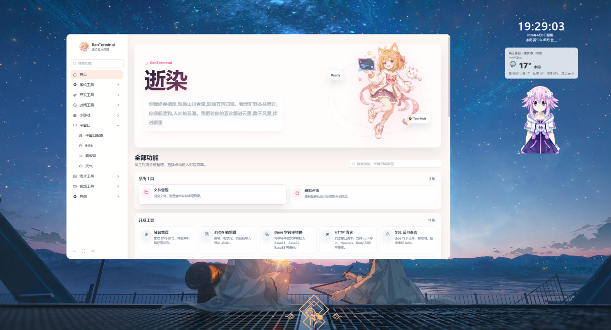

# RanPak / RanTerminal

RanPak 是一个基于 Electron、Vue 3 和本地 Node API 的桌面工具箱。项目将常用系统工具、开发工具、图片工具、视频工具、桌面部件和小游戏集中到一个本地应用中运行，适合个人日常维护、素材处理、调试接口、管理 DNS 解析和配置桌面小组件。

应用采用“本地优先”的结构：Electron 主进程启动本地 Express API，前端通过 `/api/*` 调用本地服务；大体积资源和外部二进制工具采用运行时配置，不再随仓库或安装包内置。

## 界面预览



## 功能概览

### 系统工具

- 文件管理：浏览本机目录、读取文本文件、删除文件或目录。
- 正则批量重命名：支持正则匹配、捕获组替换和 `$i` 序号。
- 模拟点击：录制鼠标点击轨迹，并按配置自动回放。

### 开发工具

- DNS 域名管理：支持阿里云 DNS、腾讯云 DNSPod、Cloudflare 和 GoDaddy。
- JSON 编辑器：格式化、编辑、校验和导入导出 JSON。
- Base 字符串转换：支持 Base64、Base32、Base58 等编码转换。
- HTTP 请求工具：构造接口请求，支持 headers、body、响应查看和 curl 导入。
- SSL 证书查询：查询证书有效期、签发者、SAN 等信息。
- 随机字符串、UUID、JWT、URL 编解码、时间戳转换、Hash/HMAC、正则测试、二维码生成。

### 图片工具

- 图片编辑：裁剪、旋转、缩放、翻转、调色、模糊、锐化、灰度、文字和贴纸处理。
- 图片压缩：按质量、尺寸和输出格式压缩图片。
- 格式转换：支持 PNG、JPEG、WebP、TIFF、GIF 等常见格式。
- 文本转图片：将文字或代码排版成可导出图片。
- 吧唧打印：生成打印排版画布。
- 拼豆工具：把图片转换为拼豆网格和色号方案。

### 视频工具

视频工具通过外置 FFmpeg / FFprobe 工作，不内置二进制文件。支持：

- 视频格式转换。
- 视频压缩。
- 时长裁剪。
- 提取音频。
- 视频截图。
- 合并视频。
- 添加文字水印。
- 读取视频编码、分辨率、音轨和字幕信息。
- 字幕处理。
- 旋转、缩放、帧率调整。
- 去除音频。
- GIF、倍速和批量处理。

### 桌面部件

- 子窗口配置：统一配置桌面部件窗口、尺寸、顺序和锁定状态。
- 时钟部件：支持时间格式、日期、农历、字体、颜色、阴影和缩放。
- Live2D 看板娘：通过外置资源目录加载模型包和 catalog。
- 天气部件：通过位置和站点配置显示天气信息。
- 闹钟、定时器、番茄钟等时间工具。

### 小游戏

- 打字练习。
- 2048。
- 数独。
- 恐龙跑酷。

## 技术栈

| 层级 | 技术 | 说明 |
| --- | --- | --- |
| 桌面端 | Electron | 创建窗口、托管 preload、启动本地 API |
| 前端 | Vue 3、Vite、Vue Router | 单页应用和路由 |
| UI | Element Plus、Tailwind CSS | 组件、布局和样式 |
| 本地 API | Express | 本地 HTTP 服务，统一提供 `/api/*` |
| 图片处理 | sharp、fabric、html2canvas | 服务端图片处理和前端画布编辑 |
| 视频处理 | FFmpeg / FFprobe | 通过设置页配置外置二进制路径 |
| Live2D | live2d-widget runtime + 外置模型包 | runtime 随应用保留，模型数据外置 |
| DNS | 阿里云 SDK、腾讯云 SDK、Cloudflare SDK、GoDaddy API | 多云 DNS 管理 |

## 项目结构

```text
ran-pak/
├── app/                         # Electron 主进程、本地 API 和打包配置
│   ├── main.js                  # 主进程入口，创建窗口并启动本地 API
│   ├── preload.js               # 暴露安全 IPC 与 API baseUrl
│   ├── package.json             # Electron 与 electron-builder 配置
│   ├── assets/
│   │   └── icons/               # 应用图标与打包图标
│   ├── config/
│   │   └── dns.yaml             # DNS provider 配置
│   ├── services/
│   │   ├── api-server.js        # Express 路由入口
│   │   ├── config.js            # 运行时目录和路径常量
│   │   ├── tools-config.js      # FFmpeg / Live2D 外置资源配置
│   │   ├── dns/                 # DNS provider 适配层
│   │   ├── files/               # 文件管理服务
│   │   ├── image/               # 图片处理服务
│   │   ├── ssh/                 # SSH 工具和插件管理
│   │   │   ├── index.js         # SSH 连接管理
│   │   │   └── plugin-manager.js # 插件扫描、安装、卸载
│   │   └── video/               # 视频任务与 FFmpeg 调用
│   ├── bundled-plugins/         # 打包时复制的内置插件
│   └── web-dist/                # 打包时复制的前端构建产物
│
├── web/                         # Vue 前端项目
│   ├── index.html
│   ├── package.json
│   ├── public/                  # 前端静态资源和轻量 runtime
│   └── src/
│       ├── components/
│       ├── data/
│       ├── pages/
│       ├── router/
│       ├── static/
│       └── utils/
│
├── plugins/                     # SSH 插件源码（默认插件）
│   ├── docker-manager/
│   ├── nginx-manager/
│   ├── systemd-manager/
│   └── kvm-manager/
│
├── docs/                        # 设计、构建和问题记录
├── scripts/
│   └── package-win.ps1          # Windows 打包脚本
├── logo.png                     # 源图标
├── start.bat                    # 本地开发启动脚本
└── README.md
```

## 运行要求

- Windows 10 / Windows 11。
- Node.js 18 或更高版本。
- npm。
- 如需使用视频工具，需要本机可用的 `ffmpeg.exe` 和 `ffprobe.exe`。
- 如需使用 Live2D 看板娘，需要准备外置 Live2D 模型资源目录和 `model-catalog.json`。

## 开发启动

### 方式一：使用启动脚本

在项目根目录运行：

```bat
start.bat
```

脚本会启动前端开发服务和 Electron 应用。

### 方式二：手动启动

安装前端依赖：

```bash
cd web
npm install
npm run dev
```

安装并启动 Electron 应用：

```bash
cd app
npm install
npm start
```

开发环境下：

- Vite 前端默认运行在 `5174` 端口。
- Electron 本地 API 默认监听本机端口，并通过 preload 注入 `apiBaseUrl`。
- 前端请求通过 `web/src/utils/api/requests.ts` 统一封装。

## 构建与打包

Windows 打包脚本：

```powershell
scripts/package-win.ps1
```

跳过依赖安装：

```powershell
scripts/package-win.ps1 -SkipInstall
```

脚本会执行以下步骤：

1. 安装 `web` 和 `app` 依赖。
2. 执行 `web` 前端构建。
3. 将 `web/dist` 复制到 `app/web-dist`。
4. 清理 `app/web-dist/vendor/live2d-widget` 下的大模型数据，只保留轻量 runtime。
5. 调用 `electron-builder` 生成 Windows NSIS 安装包。

打包产物输出到：

```text
release/
```

## 应用图标

项目根目录的 `logo.png` 是应用图标源文件。当前已生成：

```text
app/assets/icons/app.ico
app/assets/icons/icon.png
app/assets/icons/icon-16.png
app/assets/icons/icon-24.png
app/assets/icons/icon-32.png
app/assets/icons/icon-48.png
app/assets/icons/icon-64.png
app/assets/icons/icon-128.png
app/assets/icons/icon-256.png
app/assets/icons/icon-512.png
app/assets/icons/icon-1024.png
web/src/static/images/app-icon.png
web/public/app-icon.png
```

其中：

- `app/assets/icons/app.ico` 用于 Windows 安装包和快捷方式。
- `app/assets/icons/icon.png` 用于 Electron 运行时窗口图标。
- `web/src/static/images/app-icon.png` 用于应用左上角品牌图标。
- `web/public/app-icon.png` 用于 Web favicon。

## 外置工具与资源配置

外置配置保存在 Electron `userData` 目录：

```text
<userData>/config/tools.json
```

配置结构：

```json
{
  "ffmpeg": {
    "ffmpegPath": "",
    "ffprobePath": ""
  },
  "live2d": {
    "assetsDir": "",
    "catalogPath": ""
  }
}
```

### FFmpeg 配置

打开应用的“设置”页面，配置：

- `ffmpegPath`：`ffmpeg.exe` 的完整路径。
- `ffprobePath`：`ffprobe.exe` 的完整路径。

也可以留空，表示从系统 PATH 自动查找。

检测优先级：

1. 设置页保存的路径。
2. 环境变量 `RAN_PAK_FFMPEG_PATH` / `RAN_PAK_FFPROBE_PATH`。
3. 系统 PATH 中的 `ffmpeg` / `ffprobe`。

视频工具页会读取当前配置，不需要重启应用即可重新检测。

### Live2D 配置

Live2D 模型、贴图、动作、音频等大资源不进入仓库和安装包。应用只保留轻量 runtime 文件。

设置页需要配置：

- `assetsDir`：Live2D 数据包目录。
- `catalogPath`：`model-catalog.json` 文件路径。留空时默认使用资源目录下的 `model-catalog.json`。

示例目录：

```text
release/live2d-widget/
├── model-catalog.json
├── covers/
├── default-models/
└── live2d-widget-model-*/
```

catalog 是数组，示例：

```json
[
  {
    "name": "Shizuku",
    "paths": [
      "live2d-widget-model-shizuku/assets/shizuku.model.json"
    ],
    "cover": "covers/shizuku.png",
    "textures": 1,
    "message": "Shizuku"
  }
]
```

说明：

- `paths` 和 `cover` 支持相对路径。
- 相对路径以 `assetsDir` 为根目录。
- 后端会将路径标准化为 `/live2d-assets/...`。
- 前端会通过本地 API 服务加载资源，避免把大模型打入前端静态目录。

## 本地 API

所有 JSON API 均使用统一响应结构：

```json
{
  "code": 200,
  "message": "success",
  "data": {}
}
```

### 鉴权

| 方法 | 路径 | 说明 |
| --- | --- | --- |
| GET | `/api/auth/token` | 获取本地 API Token |

### DNS

| 方法 | 路径 | 说明 |
| --- | --- | --- |
| GET | `/api/dns/access` | 获取 DNS 访问配置 |
| GET | `/api/dns/access/{name}/list` | 获取域名列表 |
| GET | `/api/dns/access/{name}/records` | 获取解析记录 |
| POST | `/api/dns/access/{name}/record` | 新增解析记录 |
| PUT | `/api/dns/access/{name}/record` | 修改解析记录 |
| PUT | `/api/dns/access/{name}/record/status` | 启用或暂停记录 |
| DELETE | `/api/dns/access/{name}/record` | 删除解析记录 |

### 文件

| 方法 | 路径 | 说明 |
| --- | --- | --- |
| GET | `/api/files/list` | 获取文件列表 |
| GET | `/api/files/read` | 读取文件内容 |
| DELETE | `/api/files/delete` | 删除文件或目录 |
| PUT | `/api/files/rename` | 正则批量重命名 |

### 图片

| 方法 | 路径 | 说明 |
| --- | --- | --- |
| POST | `/api/image/upload` | 上传图片 |
| GET | `/api/image/file/{image_id}` | 获取已上传原图 |
| POST | `/api/image/preview` | 图片工作流预览 |
| POST | `/api/image/process` | 处理并导出图片 |
| POST | `/api/image/batch` | 批量处理图片 |
| GET | `/api/image/stickers` | 获取贴纸列表 |

### 视频

| 方法 | 路径 | 说明 |
| --- | --- | --- |
| GET | `/api/video/capabilities` | 检测 FFmpeg 能力 |
| POST | `/api/video/probe` | 读取媒体信息 |
| POST | `/api/video/jobs` | 创建视频任务 |
| GET | `/api/video/jobs` | 查询任务队列 |
| POST | `/api/video/jobs/{id}/cancel` | 取消任务 |

### 工具配置

| 方法 | 路径 | 说明 |
| --- | --- | --- |
| GET | `/api/tools/config` | 读取外置工具配置 |
| PUT | `/api/tools/config` | 保存外置工具配置 |
| POST | `/api/tools/ffmpeg/test` | 检测 FFmpeg 和 FFprobe |
| GET | `/api/live2d/catalog` | 读取并标准化 Live2D catalog |
| POST | `/api/live2d/catalog/test` | 使用传入配置临时检测 catalog |
| GET | `/live2d-assets/*` | 托管外置 Live2D 资源 |

## DNS 配置

DNS 配置位于：

```text
app/config/dns.yaml
```

典型配置：

```yaml
- name: example-aliyun
  type: aliyun
  access_key_id: your-access-key
  access_key_secret: your-secret

- name: example-cloudflare
  type: cloudflare
  access_key_secret: your-api-token

- name: example-godaddy
  type: godaddy
  access_key_id: your-key
  access_key_secret: your-secret
  base_url: https://api.godaddy.com
```

不同 DNS 服务商的能力并不完全一致。例如 GoDaddy 官方 API 不提供记录启停状态，前端会按“不支持状态切换”处理。

## SSH 工具插件系统

SSH 工具支持通过插件扩展功能。每个插件是一个独立目录，包含元信息、Vue 组件和样式，不参与主项目编译，在运行时由沙箱动态加载。

### 插件结构

```text
plugins/your-plugin/
├── manifest.json     # 元信息：id、名称、版本、描述、图标
├── component.js      # Vue 组件入口（template 字符串 + setup 函数）
└── style.css         # 可选样式
```

### manifest.json

```json
{
  "id": "your-plugin",
  "name": "插件名称",
  "version": "1.0.0",
  "description": "功能描述",
  "icon": "svg:<svg viewBox='0 0 24 24' ...>...</svg>",
  "author": "作者",
  "minAppVersion": "1.0.0",
  "entry": "component.js",
  "style": "style.css",
  "capabilities": ["exec"]
}
```

### component.js

组件代码通过 `new Function()` 在沙箱中执行。Vue、Composition API、Element Plus Icons 和 `useRemoteConfig` 作为参数注入，不需要 `import`。

组件接收三个 Props：

- `profileId` — 当前 SSH 连接 ID。
- `exec(cmd)` — 在远程服务器执行 shell 命令，返回 `{code, stdout, stderr}`。
- `callSsh(action, ...args)` — 调用 SSH 扩展 API。

Element Plus 已全局注册，`<el-button>` / `<el-table>` 等可直接在 template 中使用。

### 默认插件

应用内置以下默认插件，位于 `plugins/` 目录，打包时复制到 `app/bundled-plugins/`，首次启动自动同步到用户数据目录：

| 插件 | 功能 |
| --- | --- |
| docker-manager | Docker 容器、镜像、网络、卷管理 |
| nginx-manager | Nginx 站点、SSL 证书、日志管理 |
| systemd-manager | Systemd 服务管理 |
| kvm-manager | KVM/libvirt 虚拟机管理 |

### 安装与管理

- 应用内 SSH 工具的"插件"选项卡提供插件市场。
- 支持从本地 `.zip` 文件安装。
- 支持从远程注册表 URL 安装。
- 在插件市场中可启用、禁用或卸载插件。

### 开发插件

详细的插件开发规范见 `.cursor/skills/ssh-plugin-dev/SKILL.md`，涵盖沙箱 API、Props 契约、图标使用、消息提示、远程配置持久化等完整开发细节。

## 开发约定

- 前端 API 请求统一从 `web/src/utils/api/*` 发起。
- Electron preload 负责暴露文件选择、窗口控制、配置读取等能力。
- 本地 API 统一使用 `code/message/data` 响应结构。
- Live2D 模型数据和 FFmpeg 不进入仓库和安装包。
- `release/`、`web/dist/`、`app/web-dist/`、`.npm-cache/`、Live2D 大模型目录不纳入版本管理。
- Windows 上执行递归删除或同步目录时，应先校验目标路径在项目工作区内。

## 常见问题

### 视频工具显示 FFmpeg 不可用

打开“设置”，进入 FFmpeg 区域：

1. 选择 `ffmpeg.exe`。
2. 选择 `ffprobe.exe`。
3. 点击“测试”。
4. 测试通过后保存。

如果希望使用系统 PATH，可以清空两个路径，并确认命令行能直接执行 `ffmpeg -version` 和 `ffprobe -version`。

### Live2D 没有模型或加载失败

检查设置页的 Live2D 区域：

1. `assetsDir` 是否指向包含模型资源的目录。
2. `catalogPath` 是否指向有效的 `model-catalog.json`。
3. catalog 是否为数组。
4. `paths` 指向的模型 JSON 文件是否真实存在。
5. `cover` 图片是否真实存在。

可以点击“检查 Catalog”查看应用能否读取模型列表。

### 打包后没有 Live2D 模型

这是预期行为。Live2D 大模型包已经解耦，不随安装包分发。需要在安装后的应用设置页手动选择外置 Live2D 资源目录。

### 修改设置后是否需要重启

大多数配置不需要重启。FFmpeg 能力检测、视频任务、Live2D catalog 都会在运行时重新读取当前配置。若 Electron preload 或主进程代码发生变化，则需要重启应用。

## 开源项目鸣谢

本项目使用或参考了以下开源项目，在此致谢：

- [Electron](https://www.electronjs.org/)：跨平台桌面应用运行时。
- [electron-builder](https://www.electron.build/)：Electron 应用打包与安装器生成。
- [Vue](https://vuejs.org/)：前端 UI 框架。
- [Vue Router](https://router.vuejs.org/)：Vue 单页应用路由。
- [Vite](https://vitejs.dev/)：前端开发服务器与构建工具。
- [Element Plus](https://element-plus.org/)：Vue 组件库。
- [Element Plus Icons Vue](https://github.com/element-plus/element-plus-icons)：Element Plus 图标库。
- [Tailwind CSS](https://tailwindcss.com/)：实用类 CSS 框架。
- [Express](https://expressjs.com/)：Node.js Web 服务框架。
- [Multer](https://github.com/expressjs/multer)：文件上传中间件。
- [sharp](https://sharp.pixelplumbing.com/)：高性能 Node.js 图片处理库。
- [fabric.js](http://fabricjs.com/)：前端 Canvas 编辑能力。
- [html2canvas](https://html2canvas.hertzen.com/)：DOM 转 Canvas / 图片导出。
- [qrcode](https://github.com/soldair/node-qrcode)：二维码生成。
- [vanilla-jsoneditor](https://github.com/josdejong/svelte-jsoneditor/tree/main/packages/vanilla-jsoneditor)：JSON 编辑器。
- [vue-advanced-cropper](https://github.com/advanced-cropper/vue-advanced-cropper)：Vue 图片裁剪组件。
- [FFmpeg](https://ffmpeg.org/)：视频转码、裁剪、合并、截图和音频处理。
- [live2d-widget](https://github.com/stevenjoezhang/live2d-widget)：Live2D Widget runtime。
- [Live2D Cubism SDK](https://www.live2d.com/en/sdk/about/)：Live2D 模型运行能力。
- [阿里云 OpenAPI SDK for Node.js](https://github.com/aliyun/openapi-sdk-nodejs)：阿里云 DNS 接入。
- [TencentCloud SDK for Node.js](https://github.com/TencentCloud/tencentcloud-sdk-nodejs)：腾讯云 DNSPod 接入。
- [Cloudflare Node SDK](https://github.com/cloudflare/cloudflare-typescript)：Cloudflare DNS 接入。
- [GoDaddy Domains API](https://developer.godaddy.com/doc/endpoint/domains)：GoDaddy DNS 接入。
- [Open-Meteo](https://open-meteo.com/)：天气数据接口。
- [2048](https://github.com/gabrielecirulli/2048)：2048 游戏灵感与 Web 实现参考。
